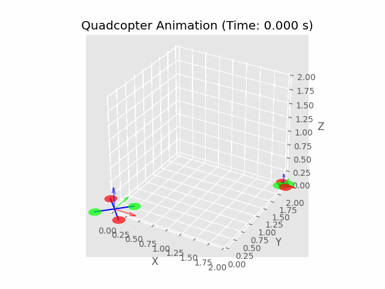

# uav_sim




The library simulates and animates uavs for analyzing controller's performance

## Usage

```bash
# Clone the repository and environment setup
git clone https://github.com/ruiqizhang99/uav_sim.git
conda create -n uavsim python=3.11
conda activate uavsim

# Navigate to the project directory
cd uav_sim
pip install -e .

# Run main code
python3 simulate.py

# Check data folder for results
```
